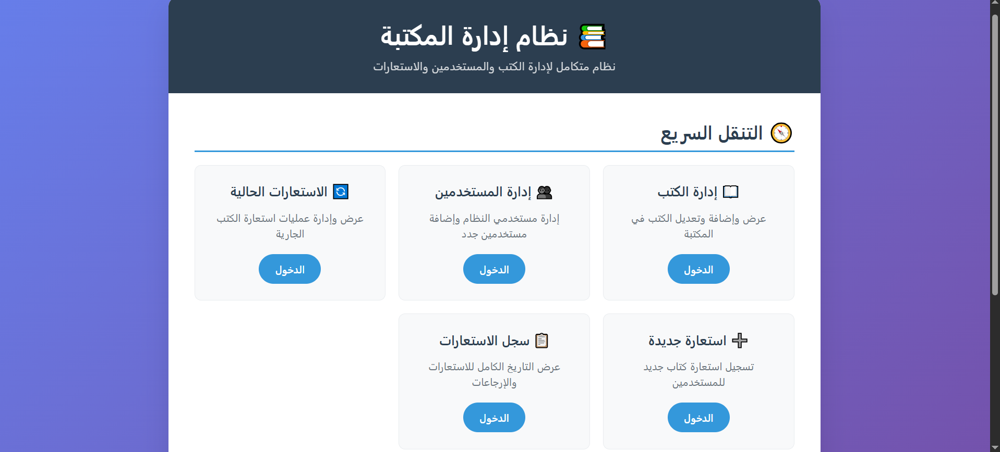
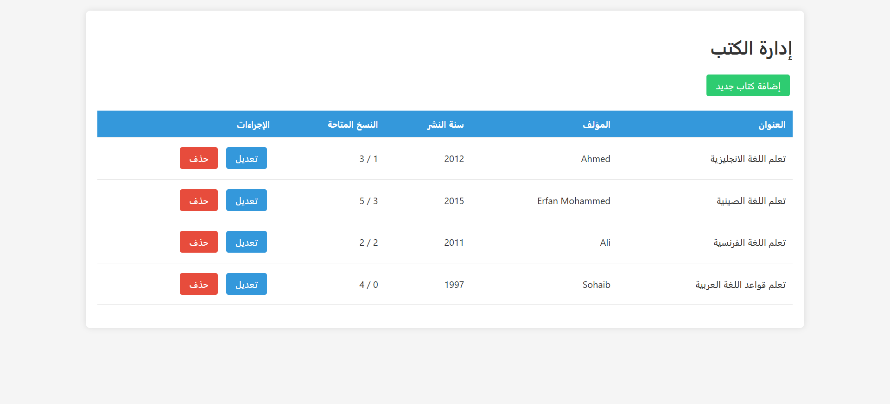
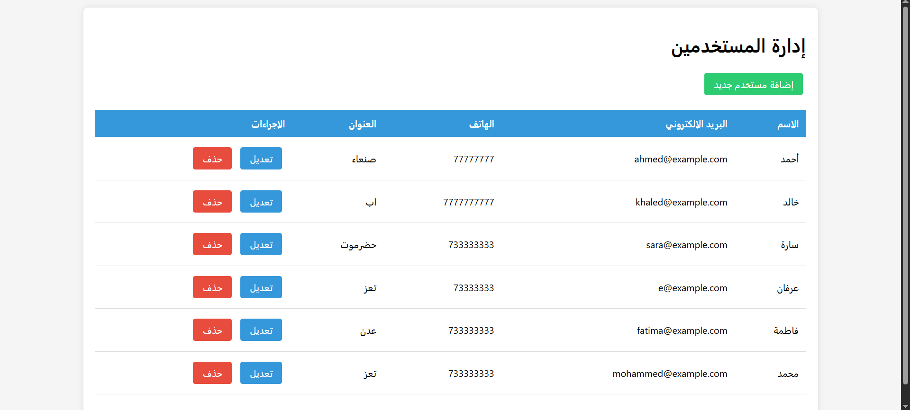
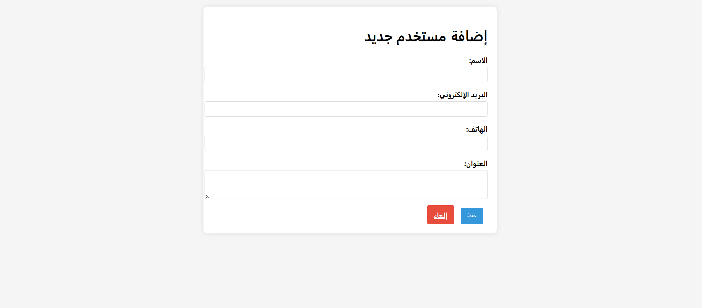
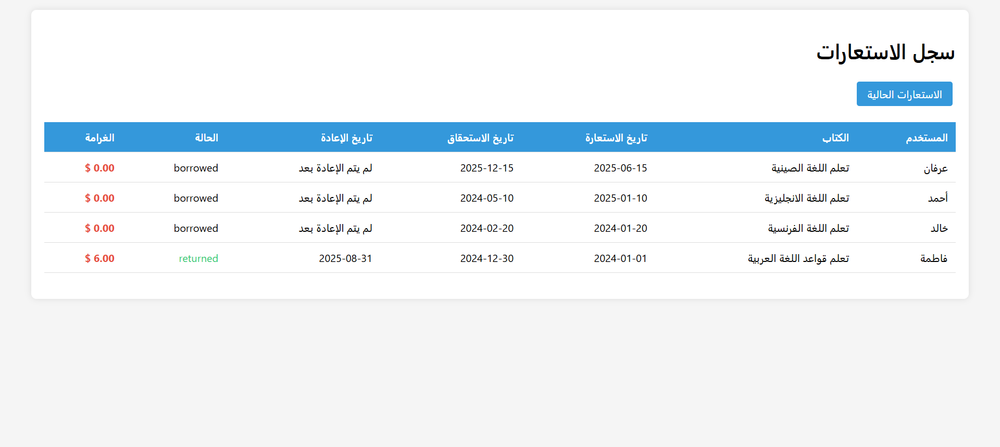
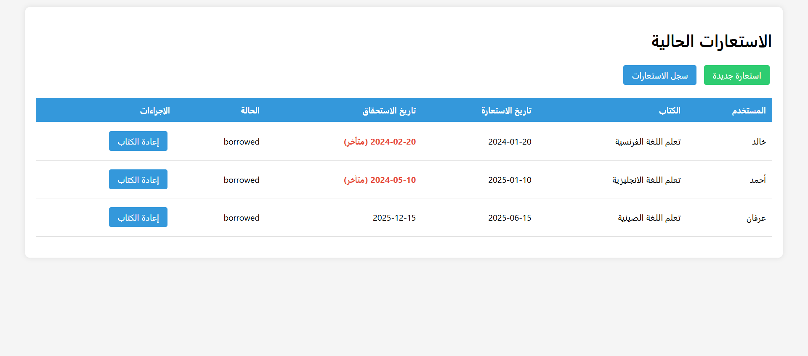

# Library Management System - Challing 3

A comprehensive Library Management System built using PHP MVC architecture with PDO and advanced OOP concepts.

##  Features

- **MVC Architecture**: Proper separation of concerns with Models, Views, and Controllers
- **CRUD Operations**: Full Create, Read, Update, Delete functionality for books and users
- **Database Transactions**: Secure borrowing/returning processes with rollback capability
- **Late Fee Calculation**: Automatic calculation of overdue book fees
- **Security**: PDO prepared statements, input validation, and XSS prevention
- **Arabic Interface**: Fully responsive Arabic user interface

### Prerequisites
- PHP 8.2 or higher
- MySQL 5.7 or higher
- Composer
- Web server (Apache/Nginx)

##  Installation

1. Clone the repository:
```bash
git clone https://github.com/Erfan-almrwani/capstone4-mvc.git
cd capstone4-mvc

2. Set up the database
mysql -u username -p database_name < database/schema.sql

3. Configure database connection:
# Edit config/database.php with your database credentials

4. Start the development server:
php -S localhost:8000

5. Open your browser and navigate to http://localhost:8000


  Project Structure
library_management/
├── config/
│   └── database.php
├── controllers/
│   ├── BookController.php
│   ├── UserController.php
│   └── BorrowController.php
├── models/
│   ├── Database.php
│   ├── Book.php
│   ├── User.php
│   └── Borrow.php
├── views/
│   ├── books/
│   ├── users/
│   └── borrows/
├── traits/
│   ├── LoggingTrait.php
│   └── SearchableTrait.php
├── interfaces/
│   └── NotificationInterface.php
├── notifications/
│   ├── EmailNotification.php
│   └── SMSNotification.php
└── index.php


## Key OOP Concepts Implemented
1.Encapsulation
-Private properties with public getters/setters
-Database connection details hidden in config

2.Polymorphism
-NotificationInterface with multiple implementations
-Flexible controller methods handling different actions

3.Traits
-LoggingTrait for system-wide logging
-SearchableTrait for reusable search functionality

4.Security Features
-PDO Prepared Statements prevent SQL injection
-htmlspecialchars() prevents XSS attacks
-Input validation and sanitization
-Error logging instead of public error display
-Disabled PDO emulated prepares


5.Database Schema
The system uses three main tables:
books: Store book information and availability
users: Store user details and contact information
borrows: Track book borrowing history and late fees


## Screenshots

1.Home Page


*Home page with system statistics*

2.Books Management

*Book management interface - view, add, edit, delete*

3.Users Management


*User management interface*

4.Borrowing Interface



*Loan and Operations Management Interface*

## Usage
1.Add Books: Navigate to Books Management → Add New Book

2.Manage Users: Go to User Management → Add New User

3.Process Borrowings: Use the Borrow section to lend books

4.Track Returns: Monitor due dates and process returns

5.Calculate Fees: System automatically calculates late fees

## Contributing
1.0Fork the project
2.Create your feature branch (git checkout -b feature/AmazingFeature)
3.Commit your changes (git commit -m 'Add some AmazingFeature')
4.Push to the branch (git push origin feature/AmazingFeature)
5.Open a Pull Request

## Authors
Erfan-almrwani

## Acknowledgments
PHP Documentation
MVC Pattern Resources
PDO Best Practices Guides